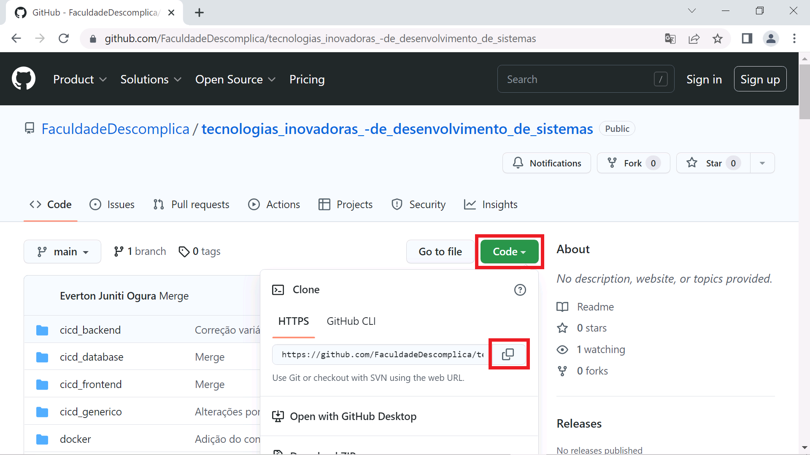
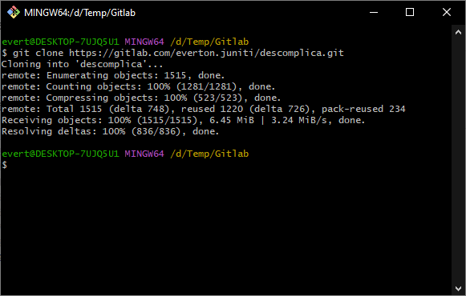
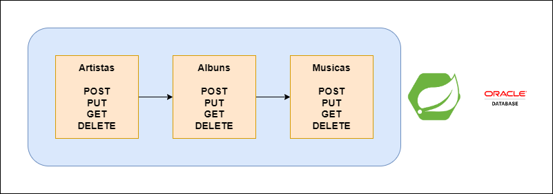
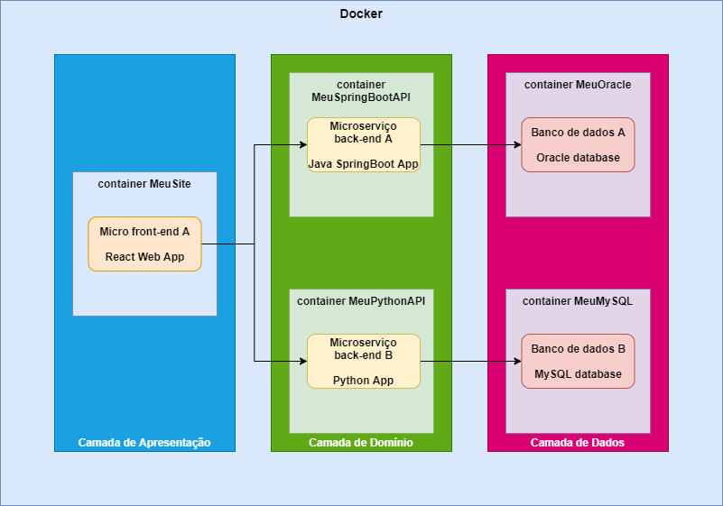

# Descomplica

Projetos de exemplo para as aulas da faculdade Descomplica

## Como funciona este repo

Este repositório está sub-dividido em alguns temas.

- docker: instruções para instalação do Docker e criação de uma "sub-rede" para que os containers se "enxerguem" e consigam "conversar" entre si. É recomendável fazer este passo antes de olhar as outras pastas do repositório!
- cicd_database:
  - mysql: instruções para subir no Docker o banco de dados MySQL de exemplo
  - oracle: instruções para subir no Docker o banco de dados Oracle de exemplo, usado na API Java SpringBoot
- cicd_backend:
  - 01-Build_Java: arquivos necessários para subida da solução via pipeline
  - springbootapi: instruções para importar uma aplicação de exemplo de API feita com Java SpringBoot e também como subir um container no Docker com esta aplicação
  - Descomplica.postman_collection.json: a collection do Postman com todas as requests pré-prontas, para testar as APIs
  - PostmanEcho.postman_collection.json: a collection do Postman com definições de uma API de teste da internet, apenas para conhecermos os conceitos de chamadas de API
- cicd_frontend:
  - 01-Build_React: script de pipeline do Gitlab CI/CD para subida da aplicação em React
  - 02-Environment: script de pipeline do Gitlab CI/CD com alterações para trabalharmos com ambientes no Gitlab
  - 03-Develop: script de pipeline do Gitlab CI/CD com alterações para diferenciarmos a branch de desenvolvimento
  - 04-Environment_Dinamico: script de pipeline do Gitlab CI/CD com alterações para conseguirmos mudar o que implantamos no ambiente com o clique de um botão
  - reactsite: instruções para importar uma aplicação de exemplo de frontend feita com React e também como subir um container no Docker com esta aplicação

Para isto, é necessário puxar o repositório para o seu computador, você pode fazer isso clonando este repositório:

A exemplo:

Depois de copiar a URL deste reposiório, abra o Git Bash e faça a clonagem do repositório, o comando é este:

`git clone https://gitlab.com/everton.juniti/descomplica.git`

A exemplo:

## Projetos

### React + Java SpringBoot + Python FastAPI + Oracle + MySQL

Pastas que fazem parte do projeto:

- docker
- cicd_database
- cicd_backend
- cicd_frontend

Desenho da estrutura de APIs:

Desenho da estrutura de containers que terão no Docker:

