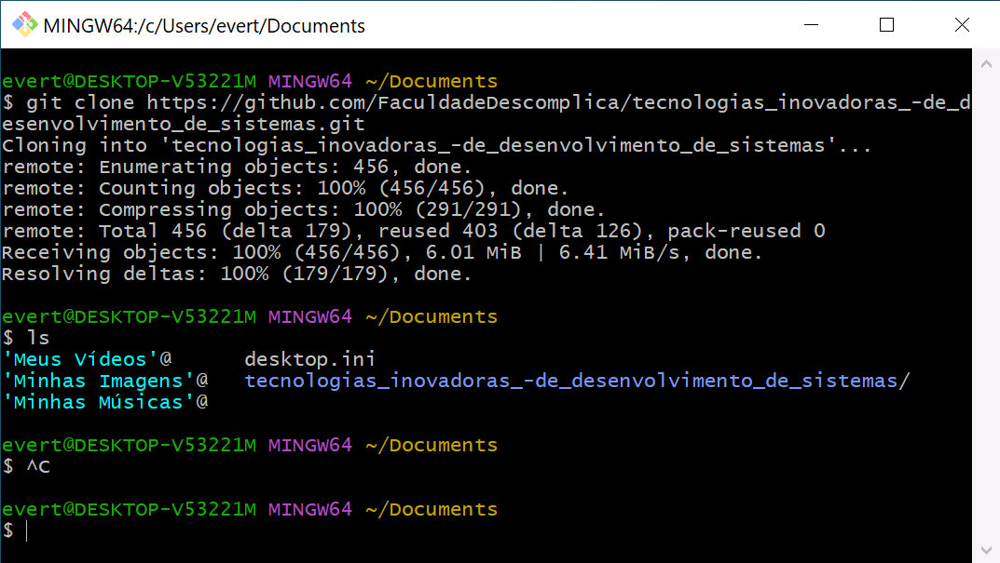
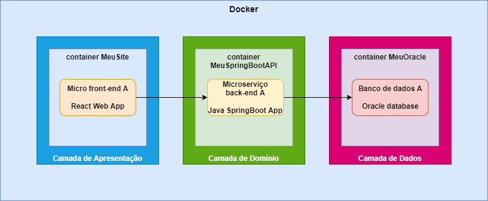

# Descomplica

Projetos de exemplo para as aulas da faculdade Descomplica

## Como funciona este repo

Este repositório está sub-dividido em alguns temas.

- docker: instruções para instalação do Docker e criação de uma "sub-rede" para que os containers se "enxerguem" e consigam "conversar" entre si. É recomendável fazer este passo antes de olhar as outras pastas do repositório!
- cicd_database:
  - oracle: instruções para subir no Docker o banco de dados Oracle de exemplo, usado na API Java SpringBoot
  - mysql: instruções para subir no Docker o banco de dados MySQL de exemplo, usado na API Python
- cicd_backend:
  - springbootapi: instruções para importar uma aplicação de exemplo de API feita com Java SpringBoot e também como subir um container no Docker com esta aplicação
  - pythonapi: instruções para importar uma aplicação de exemplo de API feita com Python e FastAPI e também como subir um container no Docker com esta aplicação
  - Descomplica.postman_collection.json: a collection do Postman com todas as requests pré-prontas, para testar as APIs

Para isto, é necessário puxar o repositório para o seu computador, você pode fazer isso clonando este repositório:

A exemplo:

Depois de copiar a URL deste reposiório, abra o Git Bash e faça a clonagem do repositório, o comando é este:

`git clone https://gitlab.com/everton.juniti/descomplica.git`

A exemplo:

## Projetos

### React + Java SpringBoot + Python FastAPI + Oracle + MySQL

Pastas que fazem parte do projeto:

- docker
- cicd_database
- cicd_backend
- cicd_frontend

Desenho da estrutura de APIs:

Desenho da estrutura de containers que terão no Docker:

