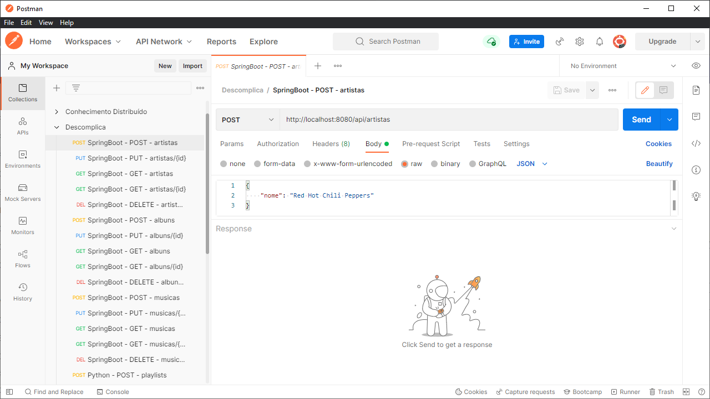

# Descomplica

Projetos de exemplo para as aulas da faculdade Descomplica

## Módulo de back-end - Java SpringBoot API

Neste respositório você encontrará um projeto já pronto! Você só terá que fazer algumas adaptações caso você altere alguma informação como o nome de usuário, senha, porta de comunicação com o banco de dados e nomes de tabelas, se você seguiu todo o passo-a-passo para subir o banco de dados Oracle da forma como está neste repositório, então provavelmente você não precisará alterar nada!

Teremos os seguintes passos:

1) Download da ferramenta de programação em Java: o Eclipse
2) Importação do projeto de API em Java SpringBoot deste repositório
3) Como criar uma imagem do Docker à partir do projeto em Java SpringBoot
4) Como subir um container para nossa API em Java SpringBoot no nosso Docker

## Download do Eclipse

Bom, a primeira coisa é fazer o download do Eclipse, que é uma ferramenta que traz facilidades para o desenvolvimento de aplicações Java.

[https://www.eclipse.org/downloads/](https://www.eclipse.org/downloads/)

Após efetuar o download, abra o instalador. Nele você encontrará várias versões para instalar, eu indico escolher a opção "Eclipse IDE for Enterprisse Java and Web Developers"

A exemplo:

Depois é só seguir as telas do instalador com as opções padrão e seguir em frente!

Quando abrir o Eclipse, pode ser que peça um local para a "workspace", pode deixar o padrão e seguir.
Uma vez que o Eclipse abra a tela de boas vindas, você pode optar por não ficar exibindo isso toda vez que abrir o Eclipse, desmarque a caixinha "Always show Welcome at start up" no canto inferior direito e depois clique no botão "Hide" no canto superior direito.

A exemplo:

## Importar o projeto API Java SpringBoot

A primeira vez que abrir, não haverá nenhum projeto. Como temos o projeto neste repositório, você pode clicar na opção "Import projects..."

A exemplo:

O projeto de exemplo deste repositório é do tipo Maven, ou seja, ele usa o repositório do Maven para fazer o download das bibliotecas de dependência para uso na aplicação.

Então quando for importar um projeto, neste caso selecione a opção "Maven" -> "Existing Maven Projects"

A exemplo:

Clique no botão "Browse" para escolher o local onde o projeto está, geralmente é a pasta onde o arquivo "pom.xml" está.

A exemplo:

Se na listagem de "projects" aparecer uma linha indicando o arquivo "pom.xml", significa que o projeto foi lido com sucesso. Agora clique no botão "Finish" para que o Eclipse carregue o projeto.

Levará um tempinho para o projeto "carregar", isso porque o Eclipse vai ler o arquivo "pom.xml" e verificar quais dependências ele precisará fazer o download no repositório do Maven para então deixar o projeto pronto para ser executado. Você verá que até que as dependências do Maven sejam baixadas (visto na parte inferior do Eclipse) o projeto ficará com um "x" em vermelho na lista de projetos (no menu à esqueda do Eclipse).

A exemplo:

Uma vez que o projeto esteja carregado, você conseguirá ver a lista de arquivos do projeto e poderá mexer e executar o projeto.

A exemplo:

Há algumas coisas interessantes para eu abordar deste projeto, primeiramente vamos olhar o arquivo "pom.xml".

- spring-boot-starter-web: esta dependência nos possibilita ter um "mini servidor web" ao rodar o nosso projeto, é através dele que conseguimos expor as APIs como um recurso da web
- spring-boot-starter-data-jpa: esta dependência nos possibilita fazer as transformações necessárias para as operações com o banco de dados, neste caso não importa qual tipo de banco de dados seja, o que importa é que o resultado final são comandos INSERT, SELECT, UPDATE e DELETE por exemplo
- ojdbc8: esta dependência permite a comunicação especificamente com banco de dados Oracle, ela trabalhará em conjunto com o Spring Data JPA para levar os comandos SQL da aplicação ao banco de dados e executá-los
- spring-boot-starter-test: esta dependência permite a criação de testes unitários
- junit: esta biblioteca trabalha em conjunto com o Spring Test, ele possui ferramentas que facilitam a escrita dos testes
- h2: esta biblioteca permite o uso de um banco de dados em memória, é necessário para rodar os testes unitários uma vez que eles não podem depender do Oracle estar disponível ou em pé

Além disso, é importante olhar que especificamente o banco de dados precisa de uma configuração especial para dizer onde está este banco de dados e como comunicarmos com ele.

Então somada à biblioteca específica do Oracle, precisamos dar uma olhada nas configurações do arquivo "application.properties" da pasta "resources".

- spring.datasource.url=jdbc:oracle:thin:@//localhost:1521/XE: aqui é indicado onde está o banco de dados (no caso localhost é a máquina local, onde está o container do Docker) e como acessá-lo (através da porta 1521 e pelo SID XE, só o Oracle tem esse tal de SID)
- spring.datasource.username=MEUUSUARIO: este é o usuário que criamos na subida do container do Oracle, através do script de inicialização pós subida do banco de dados
- spring.datasource.password=MinhaSenha: esta é a senhba que criamos atrelado ao usuário na subida do container do Oracle, através do script de inicialização pós subida do banco de dados
- spring.datasource.driver.class=oracle.jdbc.driver.OracleDriver: este é o componente responsável por usar os mecanismos para comunicação com o banco de dados através da url, username e password, é ele quem "traduz" tudo para que seja "entendido" o banco de dados Oracle

Nome que o driver é específico para cada tipo de banco de dados, se você mudar o tipo terá que mudar o driver.

Se você quiser executar a aplicação no Eclipse, basta clicar com o botão direito do mouse em cima arquivo de projeto "SpringbootapiApplication.java", ir na opção "Run As" e selecionar a sub-opção "Java Application".

A exemplo:

Vai aparecer um log com várias informações da aplicação, quando aparecer uma linha escrita "Started SpringbootapiApplication..." significa que a aplicação subiu e está pronta para uso!

A exemplo:

## Criar uma imagem do Docker

Depois que você deu uma olhada no projeto e deu uma brincada nele, é hora de criarmos uma imagem do Docker à partir desse projeto para podermos subir um container no Docker, mas antes precisamos tomar alguns cuidados:

Você deve ter notado que há um arquivo chamado "applicationProd.properties" solto na pasta do projeto, este arquivo é diferente do "application.properties" dentro da pasta "resources" do projeto, esse arquivo "applicationProd.properties" vai substituir o arquivo "application.properties" na hora de montarmos nossa imagem Docker, vamos olhar ele com calma.

Note que há uma linha diferente entre os arquivos:

spring.datasource.url=jdbc:oracle:thin:@//MeuOracle:1521/XE

Porque trocamos o "localhost" pelo "MeuOracle"?

- Quando executamos a aplicação de dentro do Eclipse, conseguimos chamar o banco de dados apontando para o "localhost" pois quando subimos o container do Oracle indicamos uma porta de entrada onde a "escuta" se dará como "localhost" na porta 1521. Isso funciona pois para nós que estamos no computador usando o Windows, localhost é o ambiente do Windows como um todo.
- Precisamos mudar para "MeuOracle" que no meu caso é o nome do container em que eu subi o Oracle, se você subiu o container com outro nome, utilize o nome que você indicou para o container. Pensa assim: um container tentando acessar o outro é dentro do ambiente do Docker, e não o ambiente do Windows, então para que um container enxergue o outro não dá para usar o "localhost". Ao subirmos um container para a API Java SpringBoot, estaremos subindo como se fosse um sistema operacional só pra ele, então "localhost" é tudo que estiver dentro do próprio container da API Java SpringBoot, como o Oracle está em outro container, está "fora" do "localhost" do container da API Java SpringBoot e é por isso que não tem como usar o "localhost" pra subir no container.

Por esta questão de um container precisar "enxergar" o outro, assim como um computador precisasse enxergar outro computador, é que indicamos no comando de criação do container o --network, é como se no final do dia você tivesse o ComputadorA com o Oracle, o ComputadorB com o Java e conectássemos ele a um roteador (nosso --network), assim um conseguirá "enxergar" e "falar" com o outro.

Veja também que temos um outro arquivo na pasta do projeto, chamado "Dockerfile", ele contém as instruções de como criar essa imagem Docker, vamos olhar com calma:

Aqui eu estou abrindo esse tipo de arquivo com o Visual Studio Code, eu acho ele visualmente melhor para olharmos esse tipo de arquivo, você pode baixá-lo no seguinte link:

[https://code.visualstudio.com/](https://code.visualstudio.com/)

Depois que instalar, só abrir o arquivo DockerFile, como se fosse um bloco de notas (só que mais bonito).

A exemplo:

Vocês verão que esse arquivo tem 2 partes: uma de build e outra de stage.
A build é literalmente compilar o projeto Java, pois é com o produto compilado que criamos a imagem.
O build é onde criamos a imagem à partir do projeto compilado.

Vamos olhar cada parte:

### build

No arquivo Dockerfile temos esta estrutura na parte de build:

- FROM maven:3.8.5-openjdk-17-slim AS build: esta instrução diz a imagem do Docker que será baixada e utilizada para fazer a compilação. Como estamos usando um projeto Java com dependências do Maven, usamos uma imagem que tenha o Maven que por sua vez lerá o pom.xml do projeto e fará o download das dependências, execução de testes unitários e build do projeto
- COPY src /home/app/src: o código-fonte do Java está na pasta "src", então o que é feito aqui é a cópia de tudo que está na pasta src pra dentro da imagem do Maven (que tem um "mini sistema operacional" próprio e a aplicação do Maven já pré-instalada), a cópia ficará numa estrutura de pastas do Linux chamada "/home/app/src"
- RUN rm -rf /home/app/src/main/resources/application.properties: aqui nós removemos o arquivo "application.properties" que está apontando para "localhost"
- COPY ./applicationProd.properties /home/app/src/main/resources/application.properties: aqui eu copio aquele "applicationProd.properties" que está apontando para o nome do container do Oracle renomeando o arquivo para "application.properties", assim eu substituo o arquivo de propriedades de conexão original
- COPY pom.xml /home/app: aqui que copio o arquivo "pom.xml" que estava fora da pasta "src", é através dele que o Maven baixará as dependências e fará o build do projeto
- RUN mvn -f /home/app/pom.xml clean package: este comando faz com que o Maven baixe todas as dependências e utilize a estratégia "clean package" que limpa todo o conteúdo (só que já não existia nada, então beleza), roda os testes unitários e faz a compilação do projeto. O projeto será compilado e ficará em um arquivo do Linux nesta estrutura: /home/app/target/springbootapi-1.0.0.jar

### stage

No arquivo Dockerfile temos esta estrutura na parte de stage:

- FROM openjdk:17-slim: É a mesma questão da imagem base da parte de build, só que a diferença aqui é que não precisamos de uma "máquina" com o Maven, aqui como o build já foi feito precisamos só de uma "máquina" com o Java, neste caso é uma versão mais enxuta do Java 17 (esta versão do Java é a que foi utilizada no projeto).
- COPY --from=build /home/app/target/springbootapi-1.0.0.jar /usr/local/lib/springbootapi.jar: copiamos o arquivo "/home/app/target/springbootapi-1.0.0.jar" que foi criado na parte de build pra dentro do Linux da imagem do Java 17, para uma estrutura chamada "/usr/local/lib/springbootapi.jar"
- EXPOSE 8080: aqui indicamos que a aplicação API Java SpringBoot estará acessível pela porta 8080 dentro do container (quando criarmos o container)
- ENTRYPOINT ["java","-jar","/usr/local/lib/springbootapi.jar"]: e finalmente esta é a instrução que será executada sempre que subir um container, neste caso ele usa a aplicação "java" presente na imagem do Java 17, indica que é para executar uma aplicação de um arquivo ".jar" através do parâmetro "-jar" e indica que o arquivo ".jar" a ser executado é o "/usr/local/lib/springbootapi.jar"

Agora precisamos abrir o Terminal do Git Bash ou o Promt de Comandos do Windows e executar a seguinte instrução:

`docker build --label springbootapi --no-cache -t springbootapi:latest .`

O "docker build" é o comando utilizado para criar uma imagem do Docker à partir das instruções do arquivo Dockerfile.

Seus parâmetros são:

- --label springbootapi: é uma informação que vai como metadado dentro da imagem, neste caso indica-se uma "etiqueta" chamada "springbootapi", você pode mudar esta etiqueta para o que você preferir
- --no-cache: indica que não haverá uso de conteúdo em cache para montar o build, o ponto ruim é que sempre serão feitos os downloads de tudo durante o build, porém isso também força o resultado final não ter o risco de alguma versão antiga em cache
- -t springbootapi:latest: é a tag referente à esta versão de imagem, então toda vez que for criado um container à partir desta imagem, é necessário indicar esta tag "springbootapi:latest", você pode mudar esta tag para o que você preferir
- .: este ponto ao final indica que o conteúdo para o build está presente na pasta atual, se estivesse em outra pasta é só trocar este . pelo caminho completo da pasta onde está o Dockerfile

A exemplo:

Ou:

Assim que o build é feito (às vezes demora um pouquinho dependendo do que tem que ser baixado e por conta do build e si), você verá a imagem na lista de imagens em seu Docker Desktop.

A exemplo:

## Subir um container do nosso API Java SpringBoot

Agora é só subir um container à partir desta imagem, através do comando:

`docker run --name MeuSpringBootAPI --network MinhaRede -p 8080:8080 -d springbootapi:latest`

Sendo:

- --name MeuSpringBootAPI: é o nome/apelido do container, é importante indicar um nome amigável para gerenciar seus vários containers, você pode indicar outro nome se preferir.
- --network [nome do Docker network]: Esse parâmetro faz com que o container fique dentro de uma "subrede" dentro do Docker. Se você quiser subir esta API Java SpringBoot para brincar conectando diretamente a ele do seu computador, não precisa deste parâmetro, agora se você quiser acessar partindo de outros containers ou acessar outros containers (como o do Oracle), isso é necessário!
- -p 8080:8080: É a configuração da porta de entrada para comunicações com esta API Java SpringBoot, sem isso você não consegue conectar na aplicação através do seu computador.
- -d: Indica que o container irá subir em modo "desatachado", ou seja, sem necessidade de abrir um terminal interativo para você estar dentro do container assim que subir. Necessário para que a API Java SpringBoot já suba rodando em background
- springbootapi:latest: É a imagem que será usada como base para subir o container, neste caso é a imagem que acabamos de criar! Se você criou a imagem com outro nome de tag, ajuste neste parâmetro

Assim que o container subir, você o verá no Docker Desktop.

A exemplo: 

Você pode testar essa API! Há uma ferramenta que permite isso facilmente, ainda mais pois este repositório possui um arquivo de collection com todas as requisições de API já salvas e prontas para você usar!

Primeiramente baixe a ferramenta Postman no link abaixo:

[https://www.postman.com/downloads/?utm_source=postman-home](https://www.postman.com/downloads/?utm_source=postman-home)

Depois de instalar, ao abrir a ferramenta você verá que poderá criar coleções ou salvar as requisições.

A exemplo:

Clique no botão "Import" para subir a coleção presente no arquivo "Descomplica.postman_collection.json", presente na pasta "cicd_backend" deste repositório.

A exemplo:

Selecione o arquivo "Descomplica.postman_collection.json".

A exemplo:

Você verá que deu certo quando a collection aparecer na tela de importação, após esta confirmação clique no botão "Import".

A exemplo:

A collection aparecerá no menu à esquerda, expandindo ela você conseguirá ver todas as requisições já salvas e prontas para uso.

A exemplo:

Você pode clicar em qualquer uma das requisições, no exemplo aqui eu cliquei na primeira requisição que é um POST, para chamada da API Java SpringBoot que cadastra um artista novo no banco de dados Oracle.

A exemplo:

No caso do POST, você precisará incluir um conteúdo no corpo da requisição, a aba "Body" já tem um exemplo que você pode alterar. Você pode checar no código-fonte da API Java SpringBoot as funcionalidades que a API oferece.

A exemplo:

Ao clicar no botão "POST" é feita uma chamada à API Java SpringBoot que responderá à requisição.

Pronto! Você já tem uma API no Docker chamando o banco de dados Oracle!
