# Descomplica

Projetos de exemplo para as aulas da faculdade Descomplica

## Módulo de banco de dados - MySQL

Aqui pra subir um banco de dados MySQL é mais simples, Teremos os seguintes passos:

1) Criação do container à partir de uma imagem do DockerHub com uma versão do MySQL
2) Criação do banco de dados
3) Criação das tabelas de exemplo

## Subindo o container do MySQL

Usaremos uma imagem oficial do MySQL puxando do repositório do DockerHub. Olhe a estrutura do comando abaixo:

`docker run --name [nome que o container terá] --network [nome do Docker network] -v [local onde estarão os dados do MySQL]:/var/lib/mysql -p 3306:3306 -e MYSQL_ROOT_PASSWORD=[A senha que você determinar para o usuário root] -e MYSQL_USER=[O nome do usuário personalizado] -e MYSQL_PASSWORD=[A senha que você determinar para o seu usuário personalizado] -d mysql:latest`

Observações importantes dos parâmetros:

----name [nome que o container terá]: é o nome/apelido do container, é importante indicar um nome amigável para gerenciar seus vários containers, mas aqui especialmente eu indiquei um nome pois é através deste mesmo nome que eu irei configurar as aplicações que estarão em outros containers que acessarão este banco de dados MySQL! Você pode indicar outro nome se preferir
- --network [nome do Docker network]: Esse parâmetro faz com que o container fique dentro de uma "subrede" dentro do Docker. Se você quiser subir o Oracle para brincar conectando diretamente a ele do seu computador, não precisa deste parâmetro, agora se você quiser acessar partindo de outros containers, isso é necessário!
- -v [local onde estarão os dados do MySQL]:/var/lib/mysql: Este parâmetro também é opcional, ele indica onde você quer que todos os dados do banco de dados fiquem armazenados. Aqui eu indiquei pois eu organizo os dados de todos os containers em um local específico
- -p 3306:3306: É a configuração da porta de entrada para comunicações com o banco de dados MySQL, sem isso você não consegue conectar no banco através do seu computador.
-e MYSQL_ROOT_PASSWORD=[A senha que você determinar para o usuário root]: Este parâmetro é importante! É a senha do usuário root que é o admin do MySQL, sem isso você não conseguirá administrar seu próprio banco de dados!
- -e MYSQL_USER=[O nome do usuário personalizado]: É um nome de usuário que será criado para você não ficar usando o usuário root pra tudo. É recomendável que você crie este usuário.
- -e MYSQL_PASSWORD=[A senha que você determinar para o seu usuário personalizado]: É a senha do MYSQL_USER que você definiu
- -d: Indica que o container irá subir em modo "desatachado", ou seja, sem necessidade de abrir um terminal interativo para você estar dentro do container assim que subir. Necessário para que o MySQL já suba rodando em background
- mysql:latest: É a imagem que será usada como base para subir o container, se nunca foi utilizado acessará o repositório do DockerHub para trazer a imagem para o repositório local do Docker.

Exemplo do comando que eu rodei aqui na minha máquina:

`docker run --name MeuMySQL --network MinhaRede -v /D/docker/volumes/mysql:/var/lib/mysql -p 3306:3306 -e MYSQL_ROOT_PASSWORD=Minha@senha -e MYSQL_USER=MeuUsuario -e MYSQL_PASSWORD=MinhaSenha -d mysql:latest`

Podemos usar o próprio Terminal do Git Bash para rodar o comando, ou abrir um "Prompt de Comando" do Windows para executar o comando.

A exemplo:

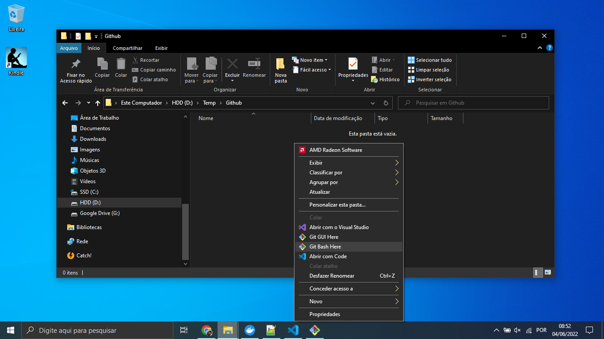
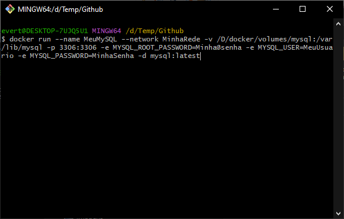

Ou:

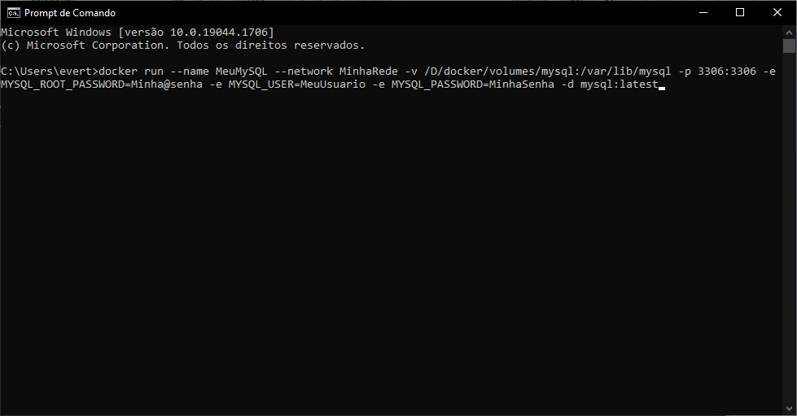

Bom, a logo que você criar o container, serão feitas várias configurações internas no MySQL, mas isso é rápido!!! Você saberá que o banco estará configurado quando aparecer a mensagem no log do container dizendo: "ready for connections".

A exemplo:

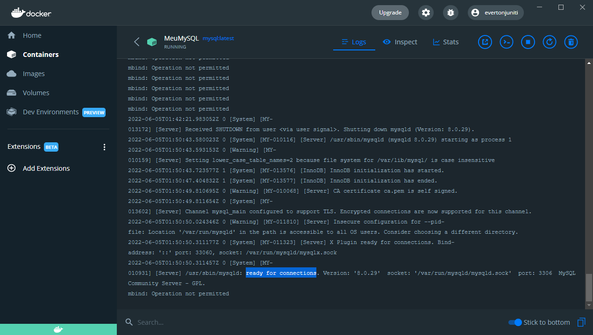

## Criando o banco de dados

Aqui neste repositório você encontrará um arquivo de script chamado "script_inicial.sql", este script cria um banco de dados dentro do MySQL que acabamos de subir e dá permissões ao usuário que indicamos no MYSQL_USER para este banco de dados recém criado.

É claro que para tudo isso eu uso aqui uma ferramenta, que acredito ser a forma mais fácil! Baixe a ferramenta no link abaixo:

[https://dev.mysql.com/downloads/workbench/](https://dev.mysql.com/downloads/workbench/)

Depois de instalar, verá que a ferramenta tem essa carinha aqui:

A exemplo:

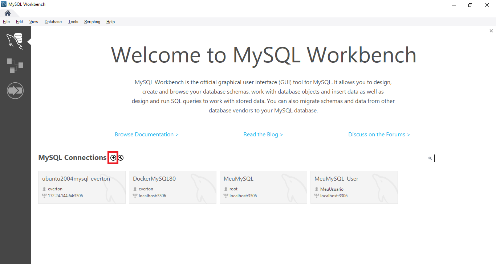

Clique no botão com um símbolo de "+" (marcado na figura acima) para criar uma nova conexão.

A exemplo:

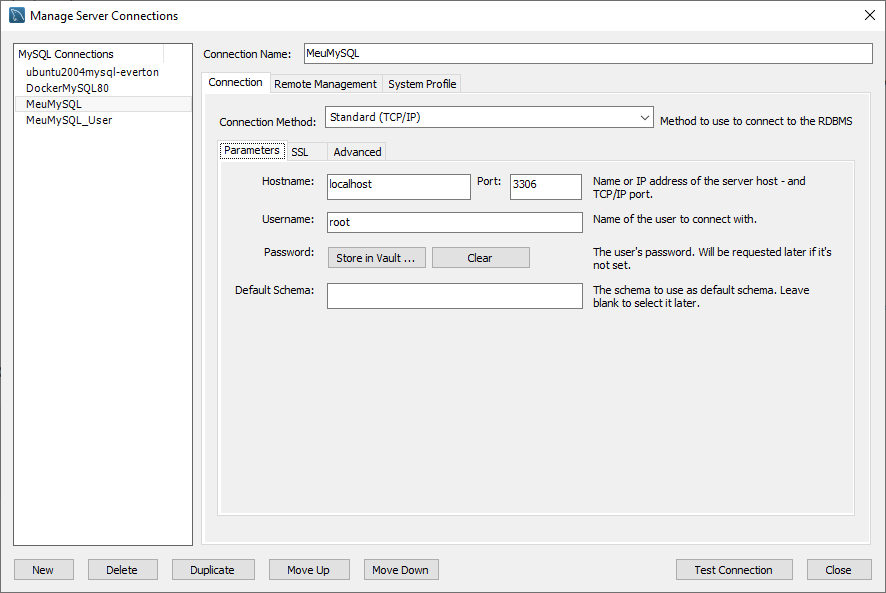

Sendo:

- Connection name: apenas um nome amigável para aparecer na lista de conexões
- Connection method: mantenha a opção "Standard TCP/IP"
- Hostname: mantenha o valor "localhost", pois é a indicação do computador local onde a instância do MySQL está instalada (no nosso caso um container do Docker)
- Username: mantenha o valor "root"
- Password: clique no botão "Store in Vault ..." e na tela que abrir, digite a senha do usuário root que você definiu no parâmetro MYSQL_ROOT_PASSWORD

Depois de ter parametrizado tudo, você poderá testar a conexão clicando no botão "Test Connection". Deveria trazer um resultado como este:

A exemplo:

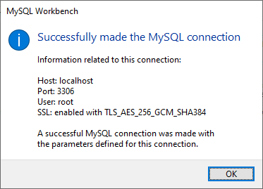

Clique no botão "Close". Pode clicar na conexão que você acabou de criar que aparecerá na lista, logo após clicar deverá aparecer uma tela em que você já pode digitar os comandos.

A exemplo:

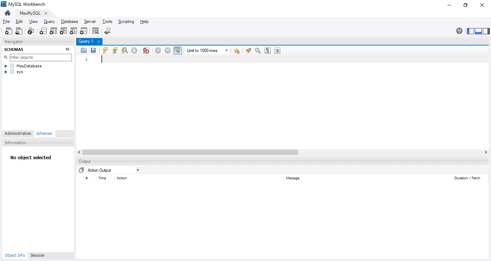

Você pode usar o script deste repositório chamado "script_inicial.sql" para criar o banco de dados e dar acesso à ele ao usuário que você definiu no parâmetro MYSQL_USER, é só abrir o arquivo clicando no ícode da pasta e selecionar o arquivo de script.

A exemplo:

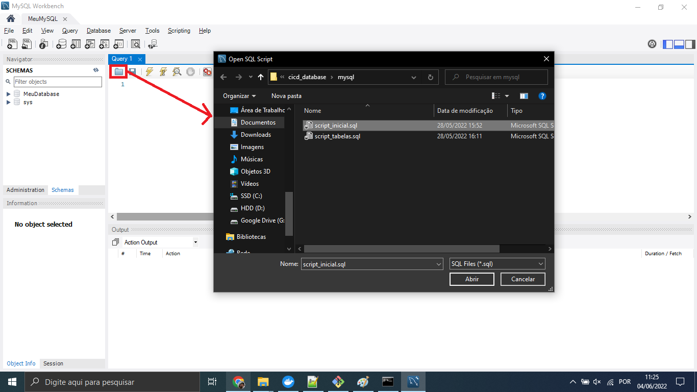

Clique no botão com um símbolo de "razio" ou pressione as teclas CTRL+SHIFT+ENTER.

A exemplo:

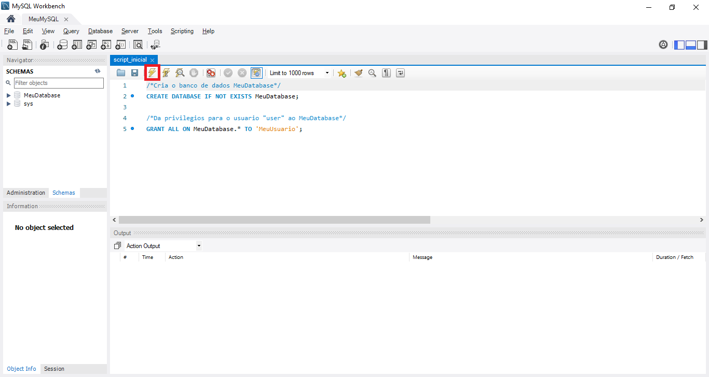

## Criando as tabelas de exemplo

Depois de criar nosso banco de dados dentro do MySQL e dar acesso à ele ao usuário não root, podemos usar este usuário não root para criar as tabelas.

Basicamente você cria uma nova conexão só que desta vez indicando o usuário que você parametrizou em MYSQL_USER e a senha do parâmetro MYSQL_PASSWORD.

A exemplo:

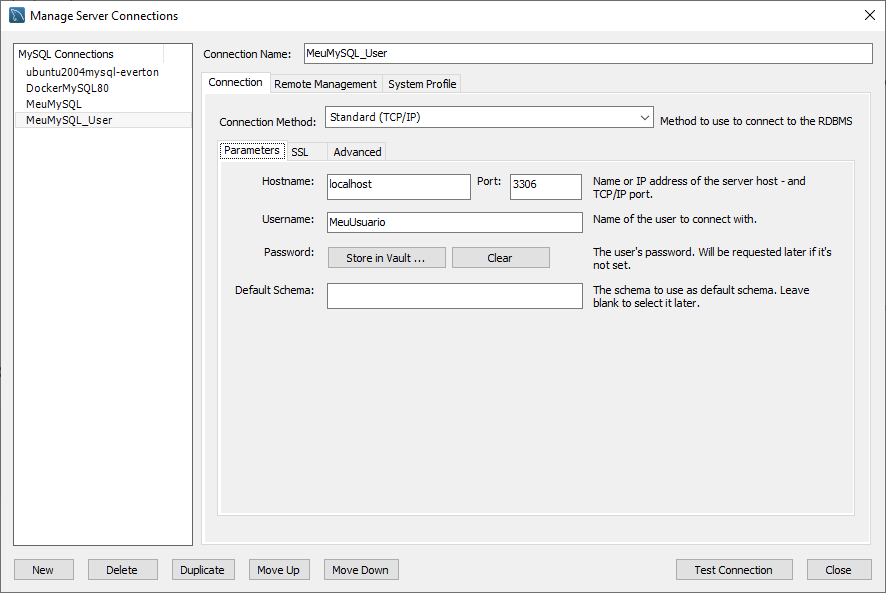

Você pode usar o script deste repositório chamado "script_tabelas.sql" para criar as tabelas, é só abrir o arquivo clicando no ícode da pasta e selecionar o arquivo de script, da mesma forma que foi feito para criar o banco de dados.

A exemplo:

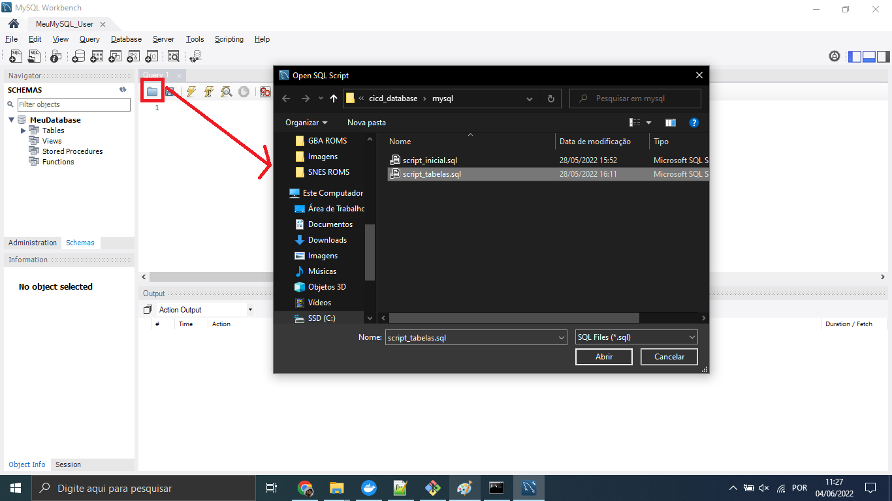

Clique no botão com um símbolo de "razio" ou pressione as teclas CTRL+SHIFT+ENTER.

A exemplo:

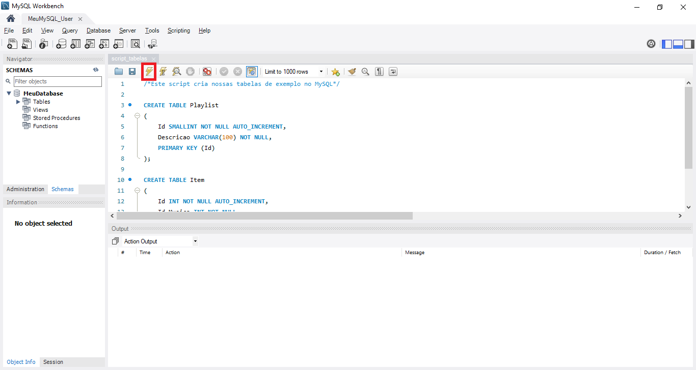

Você pode ver as tabelas criadas no menu da esquerda, expandindo a conexão dentro da subpasta "Tables".

A exemplo:

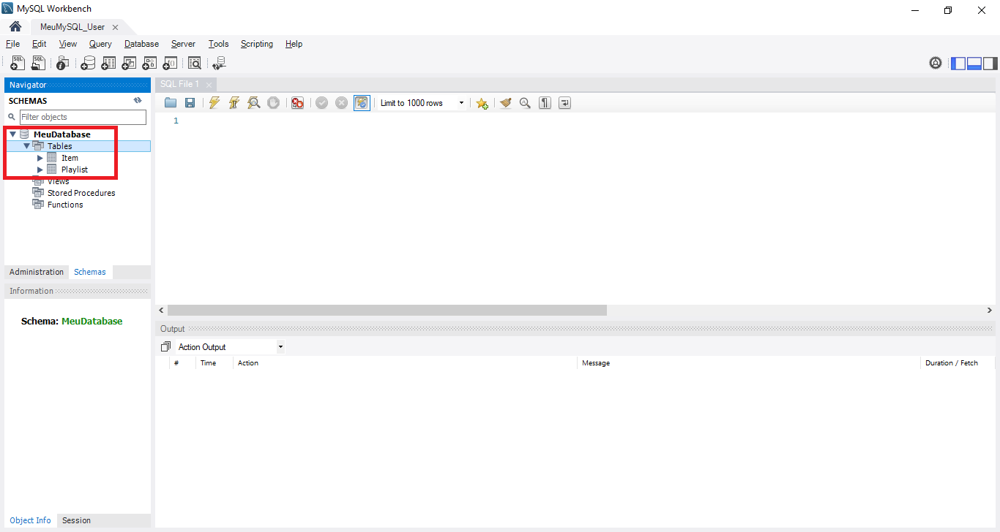

Pronto! Estamos pronto para trabalhar com nosso exemplo de tabelas com o banco de dados MySQL!
