# Descomplica

Projetos de exemplo para as aulas da faculdade Descomplica

## Módulo de banco de dados - Oracle

Este guia está todo referenciado pelo artigo que instrui como construir uma imagem do Oracle Express versão 18c.

A construção de uma imagem para uso deste banco de dados localmente (ou seja, em seu computador) é necessário visto que o repositório oficial da Oracle é fechado, ou seja, não permite o download livre das imagens.

O link de referência é este aqui: https://blogs.oracle.com/connect/post/deliver-oracle-database-18c-express-edition-in-containers

Uma vez construída a imagem é possível criar um container à partir desta imagem, possibilitando o uso de uma versão Express do Oracle, que é uma versão gratuita feita justamente para ambiente de experimentação, aprendizado (que é nosso caso aqui) ou desenvolvimento.

Bom, vamos ao que interessa!!! Resumindo muito a documentação de referência acima, teremos os seguintes passos:

1) Download do repositório do git que tem os scripts do Docker que nos possibilitarão criar nossa imagem do Oracle 18c Express edition
2) Criação da imagem através de um script já pronto e incluso no repositório do git que baixaremos
3) Criação do container da nossa imagem recém construída do Oracle 18c Express Edition
4) Criação das tabelas de exemplo

## Download do repo

Faça o download ou o clone do seguinte repositório: https://github.com/oracle/docker-images.git

Se sua opção é fazer o clone (que eu recomendo aliás), você simplesmente abre um terminal do Git Bash e digita o seguinte comando:

`git clone https://github.com/oracle/docker-images.git`

A exemplo:

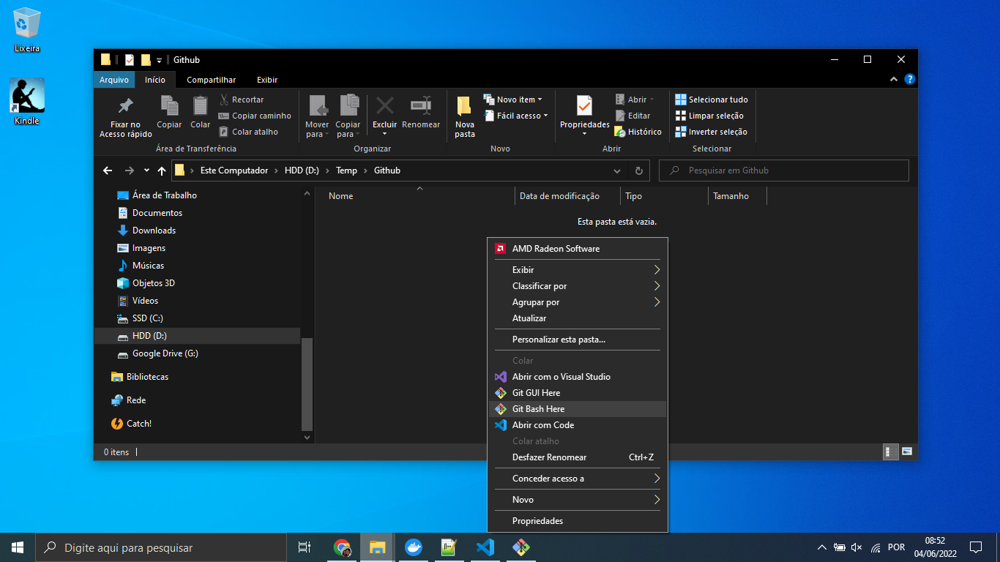
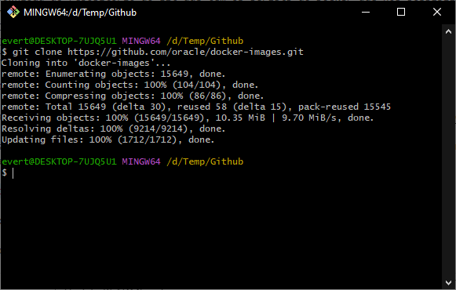

## Build da imagem do Oracle

Ok, uma vez que temos uma cópia do repositório do Oracle dentro do computador, agora é hora de criar uma imagem do Docker.

Esta imagem ficará armazenada no repositório local de imagens do Docker dentro de seu computador, não haverá necessidade de enviar a imagem para o DockerHub.

Vamos aproveitar que você ainda está com o Git Bash aberto, com o repositório recém clonado e dentro do próprio terminal do Git Bash entre dentro da pasta docker-images/OracleDatabase/SingleInstance/dockerfiles. Você pode usar esse comando aqui no terminal:

`cd docker-images/OracleDatabase/SingleInstance/dockerfiles`

A exemplo:

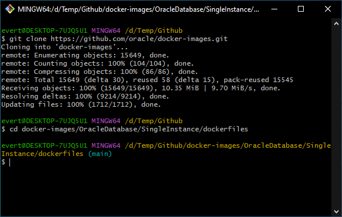

Para ver os arquivos presentes, você pode digitar o seguinte comando no terminal, após ter entrado na pasta:

`ls`

A exemplo:

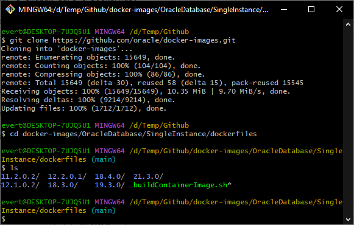

Agora sim estamos prontos para criar a imagem do Docker com uma versão do Oracle 18c Express Edition!

Bom, você deve ter percebido que há várias pastas referenetes à várias versões após ter inserido o comando anterior (ls), mas nós iremos criar a imagem baseando-nos em uma versão bem específica, seguindo o material de referência para dar certo!!!

Usaremos a versão 18.4.0, que neste momento é a imagem ideal para subirmos uma versão no Docker. Para isto, DIGITE o seguinte comando no terminal:

`./buildContainerImage.sh -v 18.4.0 -x`

E eu disse aqui DIGITE mesmo, dependendo das circunstâncias (ou seja, não sei o porquê) o copia e cola que faríamos normalmente não funciona aqui, ele dá pau.

A exemplo:

Se você fizer um CTRL+C CTRL+V (copia e cola), acontecerá isso aqui:

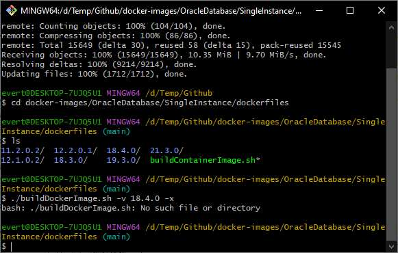

O terminal do Git Bash informa que o arquivo não existe! Então você tem que digitar mesmo.

A exemplo:

Agora digitando o comando e pressionando ENTER:

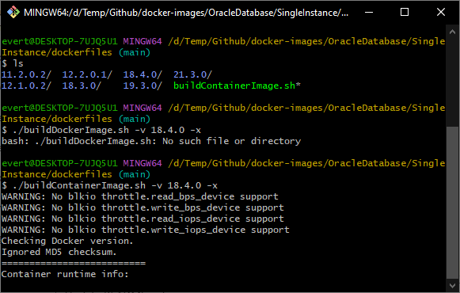

Acredite em mim quando digo que essa etapa demora, e demora muito (aqui leva cerca de 1 hora inteira)!!! Porque ele vai gerar uma imagem de mais de 6 gigas!!!

A exemplo:

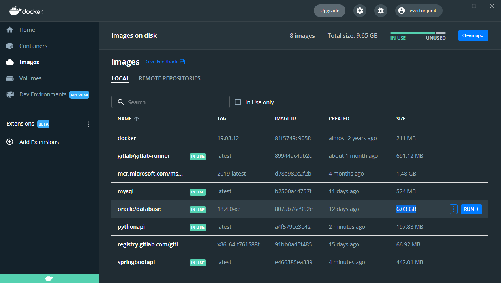

## Subindo o container do Oracle

Bom, agora que temos a imagem, bora subir um container com uma versão do Oracle!

Primeiramente há um ponto muito importante antes de executarmos o comando que cria o container. Olhe a estrutura do comando abaixo:

`docker run --name [nome que o container terá] --network [nome do Docker network] -v [local onde estarão os dados do Oracle]:/opt/oracle/oradata -v [local onde estão os scripts de inicialização]:/opt/oracle/scripts/setup -p 1521:1521 -p 5500:5500 -e ORACLE_PWD=[A senha que você determinar para o usuário SYS] -e ORACLE_CHARACTERSET=AL32UTF8 -d oracle/database:18.4.0-xe`

Observações importantes dos parâmetros:

- --name [nome que o container terá]: é o nome/apelido do container, é importante indicar um nome amigável para gerenciar seus vários containers, mas aqui especialmente eu indiquei um nome pois é através deste mesmo nome que eu irei configurar as aplicações que estarão em outros containers que acessarão este banco de dados Oracle! Você pode indicar outro nome se preferir
- --network [nome do Docker network]: Esse parâmetro faz com que o container fique dentro de uma "subrede" dentro do Docker. Se você quiser subir o Oracle para brincar conectando diretamente a ele do seu computador, não precisa deste parâmetro, agora se você quiser acessar partindo de outros containers, isso é necessário!
- -v [local onde estarão os dados do Oracle]:/opt/oracle/oradata: Este parâmetro também é opcional, ele indica onde você quer que todos os dados do banco de dados fiquem armazenados. Aqui eu indiquei pois eu organizo os dados de todos os containers em um local específico
- -v [local onde estão os scripts de inicialização]:/opt/oracle/scripts/setup: Este parâmetro também é opcional, mas indicando ele o Oracle executa todos os scripts que estiverem no local dos scripts e roda uma vez só. Isso eu usei para criar um usuário diferente para não ficar usando o SYS e também para criar um tablespace específico onde estarão nossas tabelas.
- -p 1521:1521: É a configuração da porta de entrada para comunicações com o banco de dados Oracle, sem isso você não consegue conectar no banco através do seu computador.
- -p 5500:5500: É a configuração da porta de entrada para acesso ao gerenciador do Oracle, sinceramente eu configurei mas não precisei utilizar, pois eu uso o Oracle SQL Developer.
- -e ORACLE_PWD=[A senha que você determinar para o usuário SYS]: Este parâmetro é importante! É a senha do usuário SYS que é o admin do Oracle, sem isso você não conseguirá administrar seu próprio banco de dados!
- -e ORACLE_CHARACTERSET=AL32UTF8: É o formato padrão de gravação de caracteres alfanuméricos, eu deixei o valor padrão mesmo.
- -d: Indica que o container irá subir em modo "desatachado", ou seja, sem necessidade de abrir um terminal interativo para você estar dentro do container assim que subir. Necessário para que o Oracle já suba rodando em background
- oracle/database:18.4.0-xe: É a imagem que será usada como base para subir o container, apesar do nome oracle na frente, não está sendo acessado o repositório do DockerHub, pois o script de criação da imagem que rodamos cria uma imagem com este nome e a tag database:18.4.0-xe no repositório local do Docker em seu computador.

Exemplo do comando que eu rodei aqui na minha máquina:

`docker run --name MeuOracle --network MinhaRede -v /D/docker/volumes/oracle/oradata:/opt/oracle/oradata -v /D/docker/volumes/oracle/setup:/opt/oracle/scripts/setup -p 1521:1521 -p 5500:5500 -e ORACLE_PWD=MinhaSenha -e ORACLE_CHARACTERSET=AL32UTF8 -d oracle/database:18.4.0-xe`

Observação importante: aqui eu baixei este repositório que você está lendo pois já tem os scripts tanto de inicialização (presente no comando acima em /D/docker/volumes/oracle/setup) quanto o de criação das tabelas (que eu usei por fora, após a criação do container). Se você quiser fazer igual eu fiz, jogue o arquivo deste repositório chamado "script_inicial.sql" para a pasta de setup que você tiver aí no seu computador, no meu está em: D:\docker\volumes\oracle\setup mas no seu computador pode ser em outro lugar.

Podemos usar o próprio Terminal do Git Bash para rodar o comando, ou abrir um "Prompt de Comando" do Windows para executar o comando.

A exemplo:

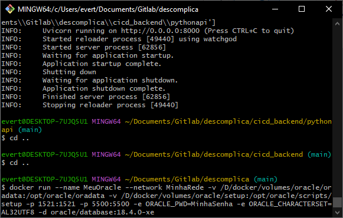

Ou:

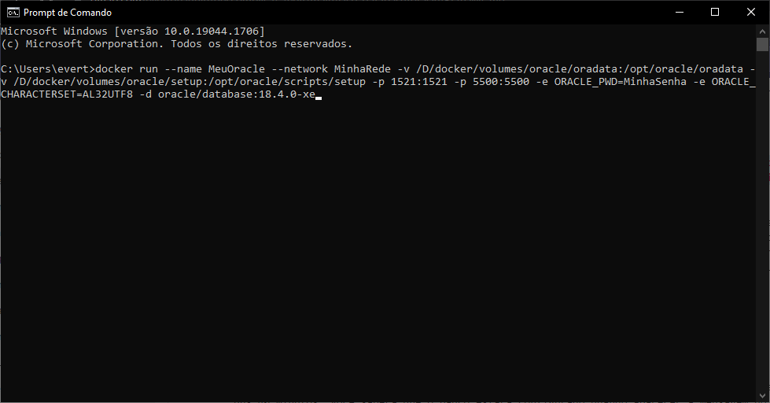

Bom, a logo que você criar o container, serão feitas várias configurações internas no Oracle e isso demora!!! Aqui levou uns 40 minutos. Você saberá que o banco estará configurado quando aparecer a mensagem no log do container dizendo: "DATABASE IS READY DO USE!".

A exemplo:

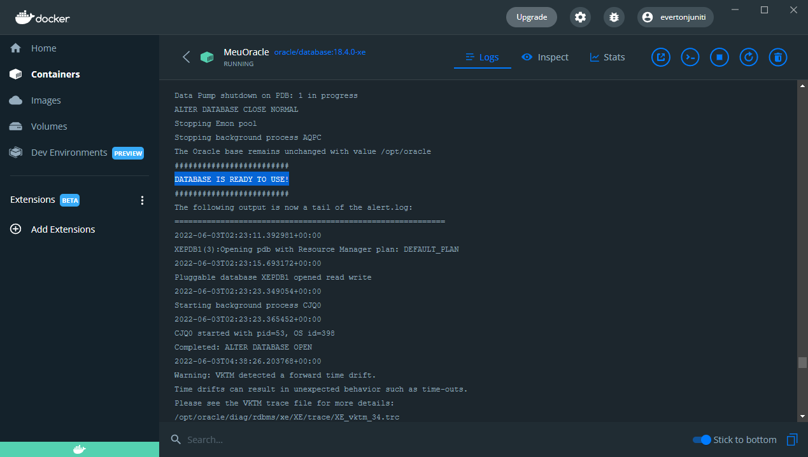

## Criando as tabelas de exemplo

Pronto! Seu container subiu e você já tem uma versão Express do Oracle 18c no seu computador!

Agora vamos criar as tabelas de exemplo! Se você rodou o comando indicando o "script_incial.sql" deste repositório, você terá em mãos um usuário criado chamado "MeuUsuario" sob a senha "MinhaSenha" e um tablespace novinho chamado "MeuTablespace". Caso contrário você terá que usar o usuário SYS e criar tudo isso (você pode olhar o script inicial para ter uma idéia de como criar).

É claro que para tudo isso eu uso aqui uma ferramenta, que acredito ser a forma mais fácil! Baixe a ferramenta no link abaixo:

[https://www.oracle.com/tools/downloads/sqldev-downloads.html](https://www.oracle.com/tools/downloads/sqldev-downloads.html)

Depois de instalar, verá que a ferramenta tem essa carinha aqui:

A exemplo:

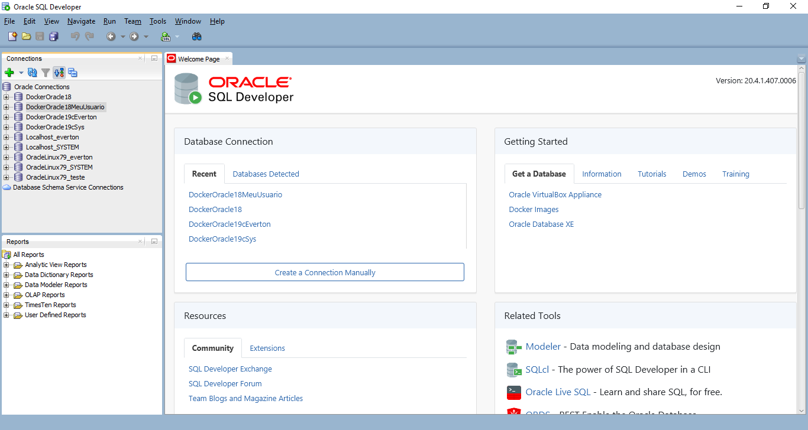

Crie uma nova conexão clicando no + (mais) verde, na guia "Connections" no menu da esquerda.

A exemplo:

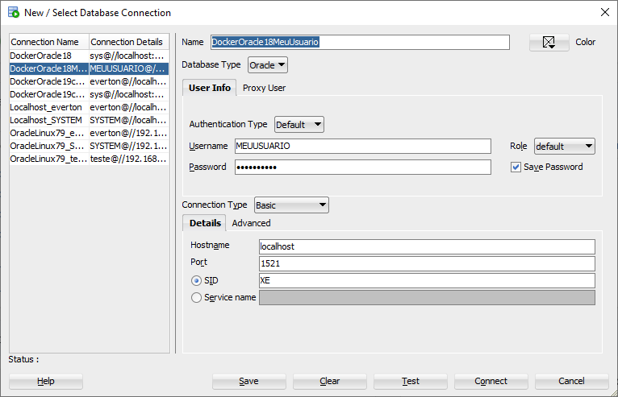

Sendo:

- Name: apenas um nome amigável para aparecer na lista de conexões
- Database Type: mantenha a opção "Oracle"
- Authentication type: mantenha a opção "Default"
- Username: aqui é o nome do usuário, no meu caso é MeuUsuario (que ele transforma em UpperCase), mas se você criou um usuário diferente, coloque o nome do usuário que você criou
- Role: mantenha a opção "Default"
- Password: aqui é a senha do usuário, uma dica é não usar o símbolo @ (arroba) como senha pois isso dá pau no oracle, pois a conexão é montada assim: [usuário]@[senha]/[servidor]:[porta]/[SID]
- Save password: aqui eu deixei "checado" para não precisar ficar digitando a senha a toda hora
- Hostname: mantenha o valor "localhost", pois é a indicação do computador local onde a instância do Oracle está instalada (no nosso caso um container do Docker)
- Port: É a porta de comunicação com o banco de dados do Oracle, se você subiu o container conforme o exemplo, é a porta 1521 que deverá ser usada
- SID: mantenha o valor "XE", que significa "Express Edition", que é justamente a versão do Oracle que construímos a imagem

Depois de ter parametrizado tudo, você poderá testar a conexão clicando no botão "Test". Deveria trazer um resultado como este:

A exemplo:

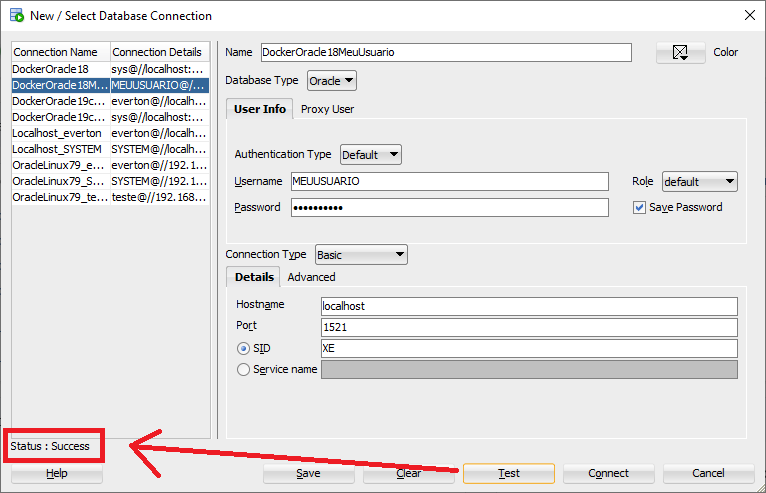

Clique no botão "Save" e depois no botão "Connect". Deverá aparecer uma tela em que você já pode digitar os comandos, à esquerda estarão as conexões que você criou e salvou, a conexão ativa possuirá um símbolo de tomada em cima da conexão.

A exemplo:

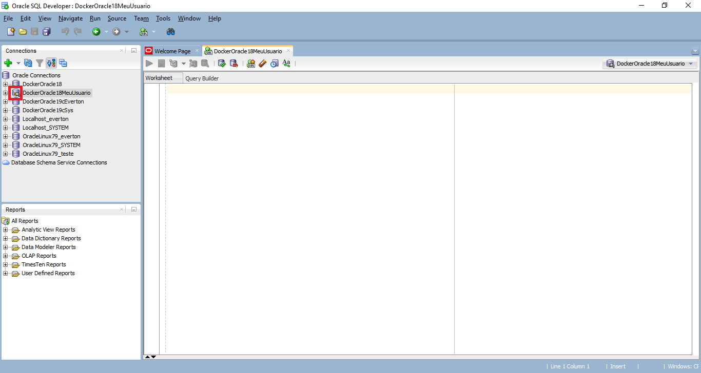

Você pode usar o script deste repositório chamado "script_tabelas.sql" para criar as tabelas, é só abrir o arquivo clicando no ícode da pasta e selecionar o arquivo de script.

A exemplo:

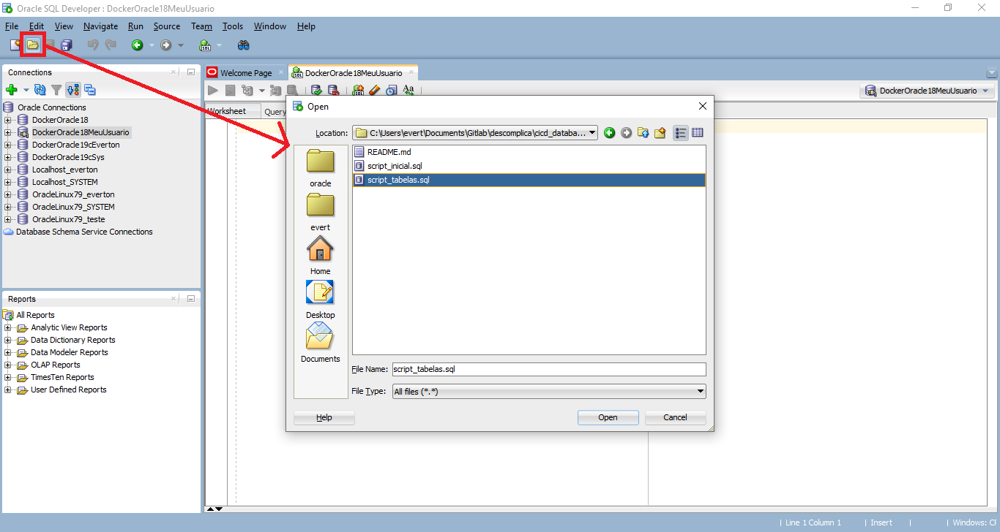

Se você abriu um arquivo, será necessário indicar a conexão que você utilizará para executar os comandos de script do arquivo aberto, para isto selecione a conexão no canto à direita.

A exemplo:

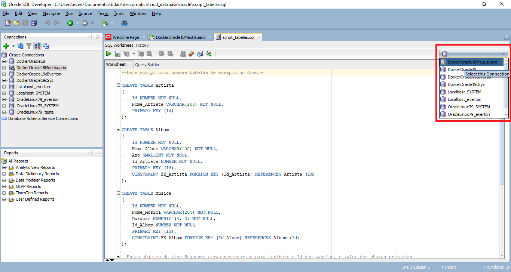

Selecione todo o conteúdo (se você estiver usando o script deste repositório, caso contrário selecione apenas o(s) comando(s) que deseja executar) e clique no botão com um símbolo de "play" ou pressione as teclas CTRL+ENTER.

A exemplo:

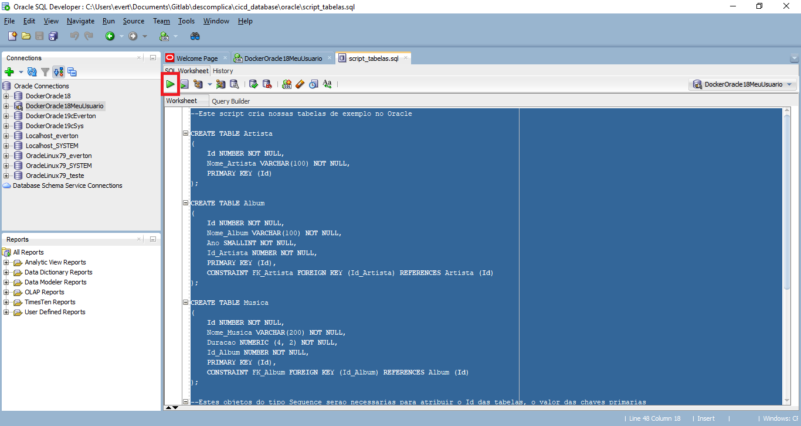

Você pode ver as tabelas criadas no menu da esquerda, expandindo a conexão dentro da subpasta "Tables".

A exemplo:

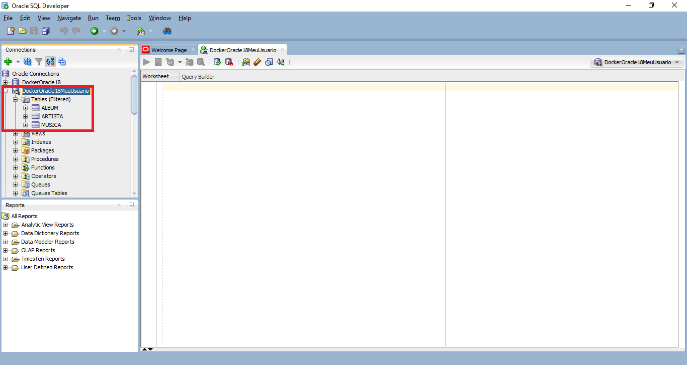

Pronto! Estamos pronto para trabalhar com nosso exemplo de tabelas com o banco de dados Oracle!
