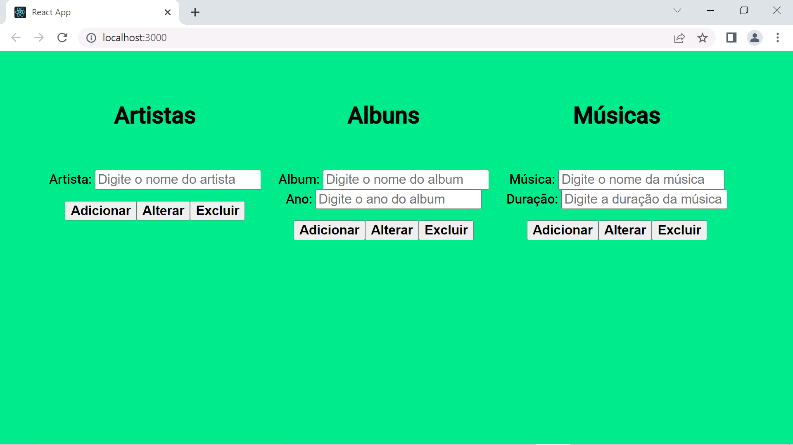

# Descomplica

Projetos de exemplo para as aulas da faculdade Descomplica

## Módulo de front-end - React

Neste respositório você encontrará um projeto já pronto! Você só terá que fazer algumas adaptações caso você altere alguma informação como os endereços de API, se você seguiu todo o passo-a-passo para subir as APIs em Java SpringBoot e Python da forma como está neste repositório, então provavelmente você não precisará alterar nada!

Teremos os seguintes passos:

1) Download do pacote de desenvolvimento Node.js e npm
2) Importação do projeto React deste repositório
3) Como criar uma imagem do Docker à partir do projeto em React
4) Como subir um container para nosso site React no nosso Docker

## Download do Node.js e npm

Bom, a primeira coisa é fazer o download do Node.js, neste caso é um pacote de desenvolvimento que nos permite programar e compilar aplicações Javascript.

[https://nodejs.org/en/download/](https://nodejs.org/en/download/)

No instalador, certifique-se que o item "npm package manager" esteja como um item marcado para instalação, deverá estar conforme a imagem abaixo:

Os demais passos do instalador é basicamente seguir mantendo as opções padrão.

Adicionalmente você poderá instalar (caso ainda não tenha feito isso) o Visual Studio Code, ele será suficiente para vermos os códigos-fonte do site:

[https://code.visualstudio.com/](https://code.visualstudio.com/)

## Importação do projeto React deste repositório

Pronto! Agora já podemos puxar os pacotes do site em React e abrir ele, para isso vá na pasta do reactsite (esta mesma desta documentação) pelo Prompt de Comando do Windows e digite o seguinte comando para que as bibliotecas às quais o site depende sejam baixados para a sua máquina:

`npm install`

Depois de um tempinho o download irá finalizar, agora você pode testar o site à partir do seguinte comando:

`npm start`

Deverá aparecer isso no Prompt de Comandos:

E o site irá abrir no seu browser:

## Como criar uma imagem do Docker à partir do projeto em React

Depois que você deu uma olhada no projeto e deu uma brincada nele, é hora de criarmos uma imagem do Docker à partir desse projeto para podermos subir um container no Docker, veja que temos um arquivo chamado "Dockerfile", ele contém as instruções de como criar essa imagem Docker, vamos olhar com calma:

Obs: Aqui eu estou abrindo esse tipo de arquivo com o Visual Studio Code.

A exemplo:

Vamos olhar cada linha deste Dockerfile:

- FROM node:slim: esta instrução diz a imagem do Docker que será baixada e utilizada para fazer a compilação. Como estamos usando um projeto React com dependências do Node.js, temos que usar uma imagem que possua o Node.js
- WORKDIR /app: aqui definimos que a pasta app será a pasta para o Docker "olhar" para executar os demais comandos
- ENV PATH /app/node_modules/.bin:$PATH: inclusão doda pasta app/node_modules/.bin no PATH, que é uma variável de ambiente do sistema operacional
- COPY ./src /app/src: cópia dos arquivos de código-fonte do projeto para a pasta /app/src
- COPY ./public /app/public: cópia dos arquivos públicos como imagens, ícones e o index.html para a pasta /app/public
- COPY package.json /app/package.json: cópia do arquivo package.json que possui todas as bibliotecas que o site é dependente para a pasta /app
- RUN npm install: execução do comando npm install, que baixa todas as dependências (mencionadas no arquvo package.json)
- RUN npm install react-scripts@3.3.1 -g: instala um pacote específico para rodar o projeto
- EXPOSE 3000: indica que será exposta a porta 3000 para conseguirmos interagir com a aplicação
- CMD ["npm", "start"]: indica que o comando que será executado será o npm start para subir a aplicação

Agora precisamos abrir o Terminal do Git Bash ou o Promt de Comandos do Windows e executar a seguinte instrução:

`docker build --label reactsite --no-cache -t reactsite:latest .`

O "docker build" é o comando utilizado para criar uma imagem do Docker à partir das instruções do arquivo Dockerfile.

Seus parâmetros são:

- --label reactsite: é uma informação que vai como metadado dentro da imagem, neste caso indica-se uma "etiqueta" chamada "reactsite", você pode mudar esta etiqueta para o que você preferir
- --no-cache: indica que não haverá uso de conteúdo em cache para montar o build, o ponto ruim é que sempre serão feitos os downloads de tudo durante o build, porém isso também força o resultado final não ter o risco de alguma versão antiga em cache
- -t reactsite:latest: é a tag referente à esta versão de imagem, então toda vez que for criado um container à partir desta imagem, é necessário indicar esta tag "reactsite:latest", você pode mudar esta tag para o que você preferir
- .: este ponto ao final indica que o conteúdo para o build está presente na pasta atual, se estivesse em outra pasta é só trocar este . pelo caminho completo da pasta onde está o Dockerfile

A exemplo:

Ou:

Assim que o build é feito (às vezes demora um pouquinho dependendo do que tem que ser baixado e por conta do build e si), você verá a imagem na lista de imagens em seu Docker Desktop.

A exemplo:

## Subir um container do nosso API Java SpringBoot

Agora é só subir um container à partir desta imagem, através do comando:

`docker run --name MeuReactSite --network MinhaRede -p 3000:3000 -d reactsite:latest`

Sendo:

- --name MeuReactSite: é o nome/apelido do container, é importante indicar um nome amigável para gerenciar seus vários containers, você pode indicar outro nome se preferir.
- --network [nome do Docker network]: Esse parâmetro faz com que o container fique dentro de uma "subrede" dentro do Docker. No caso do site em React esta parte é totalmente opcional uma vez que o site acaba rodando no seu browser, fora do ambiente de rede dos containers do Docker
- -p 3080:3080: É a configuração da porta de entrada para comunicações com este site em React, sem isso você não consegue conectar na aplicação através do seu computador.
- -d: Indica que o container irá subir em modo "desatachado", ou seja, sem necessidade de abrir um terminal interativo para você estar dentro do container assim que subir. Necessário para que o site em React já suba rodando em background
- reactsite:latest: É a imagem que será usada como base para subir o container, neste caso é a imagem que acabamos de criar! Se você criou a imagem com outro nome de tag, ajuste neste parâmetro

Assim que o container subir, você o verá no Docker Desktop.

A exemplo: 

Você pode abrir o site clicando nos "três pontinhos" à direita do container recém criado e depois clicando na opção "Open with browser".

A exemplo:

Isso irá abrir o browser com o endereço localhost:3000, você também poderia abrir manualmente o browser e digitar este endereço, isso fará com que o browser chame a aplicação do Docker.

A exemplo:

Pronto! Você já seu site em React no Docker!

Observação: se a API em Java Springboot e o banco de dados em Oracle estiverem de pé no Docker, você vai poder testar a integração site -> API -> banco de dados!