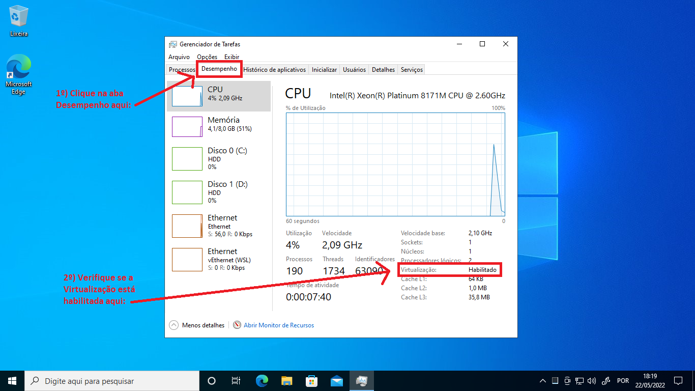
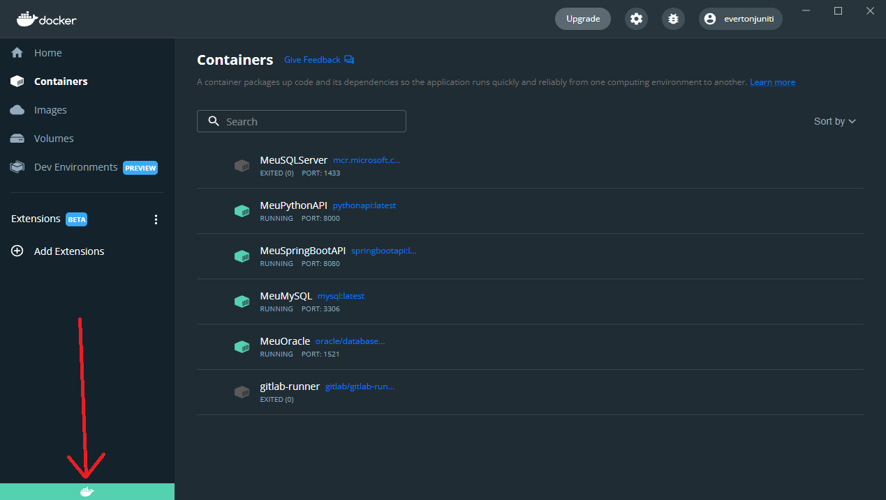

# Descomplica

Projetos de exemplo para as aulas da faculdade Descomplica

## Docker

Esta pasta do repositório possui informações relevantes em relação ao Docker que sugiro acompanhar e fazer.

- Instalação do Docker Desktop
- Criação de uma "sub-rede" para que os containers consigam se comunicar

## Instalar o Docker Desktop

Para instalar o Docker Desktop, há alguns requisitos mínimos que seu computador deve ter, tais como:

- Windows 10 ou superior
- Processador deve ter uma arquitetura de 64 bits
- Mínimos 4Gb de memória RAM (eu recomendo pelo menos 8Gb)
- Virtualização habilitada

Vamos ver primeiro a parte de virtualização, para isto faça os seguinte:

Abra o gerenciador de tarefas do Windows:

Vá na aba "Desempenho", guia "CPU" e observe o item "Virtualização" no painel abaixo do gráfico. Teria que estar com o valor "Habilitado".

Se não estiver habilitado, você terá que ter algum conhecimento mais avançado para olhar a BIOS da máquina e ver se é possível alterar, eu digo ver se é possível pois depende do fabricante do processador de seu computador, você poderá consultar o manual do fabricante para lhe ajudar, mas caso não tenha conhecimento sugiro ou procurar ajuda especializada ou contratar um serviço de suporte à computador.

Abaixo estão alguns exemplos de configuração de BIOS de alguns fabricantes, mas pode ser que não se encaixe com o seu caso.

Exemplos de BIOS para habilitar virtualização:

Uma vez que os requisitos mínimos estejam atendidos, você poderá instalar o Docker Desktop.

Mas antes há uma coisa importante sobre o ambiente do Docker, você poderá escolher entre usar a plataforma do próprio Windows como host ou uma plataforma em Linux.

Eu recomendo o uso da plataforma Linux como host de todos os containers que subiremos, afinal a grande maioria das soluções em container que vemos no mercado (principalmente no DockerHub) são soluções baseadas em Linux. Não há demérito para as soluções Windows, elas apenas não possui a vastidão que o Linux possui até o momento em que estava escrevendo aqui.

Bom, então vou incluir aqui um passo-a-passo de como habilitar o WSL (Windows Subsystem for Linux). O que será feito na prática é a habilitação de algo que já vem no Windows 10 ou versão posterior que é rodar uma versão do Linux dentro do Windows, até o momento em que escrevo é a versão Ubuntu Linux 20.04.

É melhor fazer este passo antes de instalar o Docker Desktop pois no início da instalação será solicitado se você quer utilizar o WSL ou não (e você escolherá usar o WSL sim!), para isso, abra o PowerShell como administrador (se não abrir como administrador, você não conseguirá instalar o WSL), vá na barra de pesquisa do Windows e digite PowerShell que aparecerá esta opção, conforme imagem abaixo:

Digite o comando abaixo para instalar o wsl:

`wsl --install`

Se o wsl já tiver sido instalado, aparecerá algo como a imagem abaixo, do contrário você deverá aguardar a instalação.

Esta é a versão que já vem "de fábrica" com o Windows, você só o habilitou, mas é necessário fazer o upgrade para a versão wsl2, para isto baixe o pacote de upgrade no link abaixo:

[https://docs.microsoft.com/pt-br/windows/wsl/install-manual#step-4---download-the-linux-kernel-update-package](https://docs.microsoft.com/pt-br/windows/wsl/install-manual#step-4---download-the-linux-kernel-update-package)

O instalador é bem simples e rápido. Após instalar reinicie seu computador.

Finalmente, baixe o Docker Desktop com o link abaixo:

[https://docs.docker.com/desktop/windows/install/](https://docs.docker.com/desktop/windows/install/)

Faça a instalação e lembre-se de habilitar o uso do WSL! Na primeira vez que for abrir o Docker Desktop, aceite os termos de uso.

Pronto! Você já está pronto para usar o Docker!

## Criar a sub-rede

Bom, agora que temos o Docker instalado, vamos criar uma sub-rede! Isso é necessário para que os containers consigam se comunicar entre si, se você não fizer isso um container não conseguirá "enxergar" o outro e comunicar-se. É como se cada container fosse um computador separado, se você não colocá-los no mesmo "hub" ou "switch", não haverá comunicação entre eles, apesar de você conseguir utilizá-los individualmente.

Há outras abordagens para que você consiga fazer isso, mas criar uma "sub-rede" para o propósito deste material é a forma mais fácil.

Bom, verifique se o Docker está "ativo", para isso você pode abrir o Dashboard do Docker Desktop e verificar se a cor da barrinha do Docker se está azul (se estiver amarelo é porque está inicializando, se estiver cinza é porque está inativo):

Ou você pode olhar na barra de tarefas do Windows e passar o mouse em cima do ícone do Docker:

Abra o Prompt de Comando do Windows, para isso vá na barra de pesquisa do Windows e digite "cmd", depois abra o aplicativo:

No prompt de comando aberto, digite o seguinte comando:

`docker network ls`

Isso listará todas as "sub-redes" existentes no ambiente do Docker em seu computador. O meu está assim:

Eu marquei na imagem as 3 "sub-redes" que existem por padrão, é o que você verá em sua lista.

Vamos entender as opções que apareceram (olhar a coluna NAME da lista):

- bridge: esta "sub-rede" é do tipo bridge (olhar a coluna DRIVER), usar ela já permitiria seus containers enxergarem uns aos outros, porém somente pelo endereço IP de cada container, só que isso não é muito prático pois se você precisar destruir um container e criá-lo novamente, provavelmente o container ganhará outro endereço IP, o que fica impraticável ficar trocando em todas as suas aplicações que dependam daquele container, mas é a opção para que os containers se enxerguem. Com esta opção você também consegue acessar o container partindo do seu computador (que é o host do Docker)
- host: esta "sub-rede" é do tipo host (olhar a coluna DRIVER), usar ela permite com que você consiga acessar o container partindo do seu computador, só que os containers não conseguirão acessar uns aos outros, só você conseguirá acessá-los através de um terminal interativo.
- none: neste caso indica que o container não está "plugado" em nenhuma "sub-rede", logo não será possível conectar nele

Para facilitar nossa vida, podemos criar a nossa "sub-rede" pois o Docker tem um mecanismo interessante: se você cria a sua "sub-rede" com o DRIVER bridge (que é o padrão), você consegue fazer com que os containers enxerguem um ao outro através do nome do container, o que ajuda muito pois se eu crio um container chamado, por exemplo, de "MeuContainer", não importa se eu tenha que destruí-lo e recriá-lo várias vezes, mesmo mudando o endereço IP do container eu consigo chamar pelo nome, isso faz com que eu não precise atualizar as aplicações que olham para este container específico.

Para criar esta "sub-rede", você pode usar o seguinte comando:

`docker network create [nome da sua "sub-rede"]`

No meu caso aqui eu criei uma "sub-rede" chamado "MinhaRede", se você quiser criar igualzinho, só digitar o comando:

`docker network create MinhaRede`

Pronto! Agora toda vez que você criar um container novo, lembre-se de incluir a sub-rede, como por exemplo:

`docker run --name nginx --network MinhaRede --publish 9080:80 -d nginx:latest`

Esse comando acima cria um container com uma imagem do nginx, veja a parte "--network MinhaRede", é através desse parâmetro que eu indico que o container "entrará" nessa "sub-rede" chamada "MinhaRede".

Você pode usar o comando à seguir para ver todos os containers que fazem parte dessa "sub-rede" que criamos:

`docker network inspect MinhaRede`

Se sua "sub-rede" tiver um outro nome, substitua o nome "MinhaRede" pelo nome da sua "sub-rede".

Veja que é nos mostrado a lista de containers que fazem parte desta "sub-rede", cada uma ganha um endereço IP próprio, mas os containers conseguirão se "conversar" pelo nome do container:

Vou criar um outro container com o nginx, só que sem indicar a "sub-rede":

`docker run --name nginx2 --publish 9180:80 -d nginx:latest`

Se quisermos fazer com que este container novo chamado "nginx2" faça parte da nossa "sub-rede", você pode usar o seguinte comando para "plugá-lo" na "sub-rede":

`docker network connect MinhaRede nginx2`

Se você executar novamente o comando abaixo, você verá que o container "nginx2" conseguiu "ingressar" na "sub-rede":

`docker network inspect MinhaRede`

